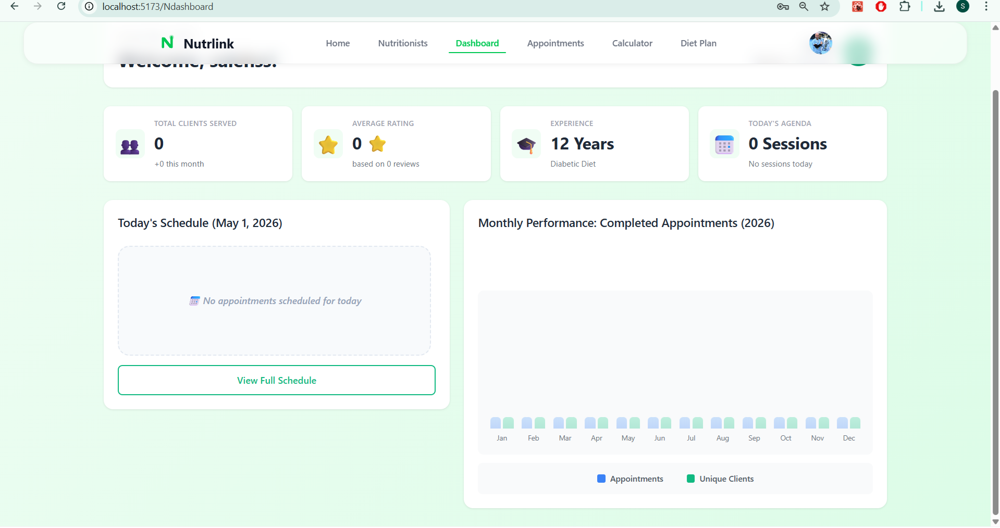
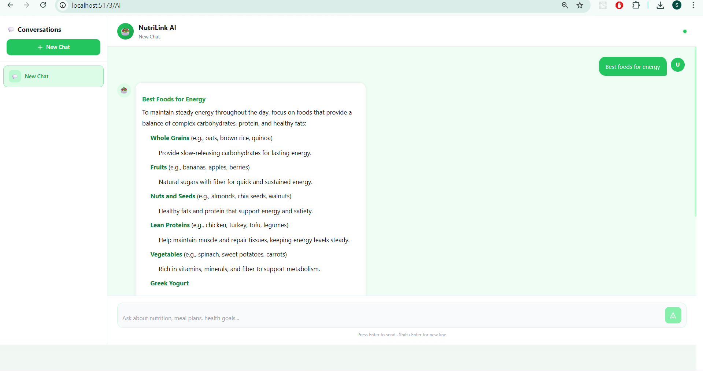

# NutriLink 🥗

A comprehensive nutrition and wellness platform connecting clients with certified nutritionists through personalized consultations, meal planning, and AI-powered nutrition guidance.


## 📋 Table of Contents

- [Overview](#overview)
- [Features](#features)
- [Tech Stack](#tech-stack)
- [Project Structure](#project-structure)
- [Getting Started](#getting-started)
- [User Roles](#user-roles)
- [Key Components](#key-components)
- [API Integration](#api-integration)
- [Environment Variables](#environment-variables)
- [Screenshots](#screenshots)
- [Contributing](#contributing)
- [License](#license)

## 🌟 Overview

NutriLink is a modern web application that bridges the gap between health-conscious individuals and professional nutritionists. The platform offers personalized nutrition consultations, AI-powered dietary advice, progress tracking, and comprehensive health management tools.

**System Architecture**:
- **Frontend**: React 18+ (this repository)
- **Backend**: Node.js + Express + MongoDB ([Backend README](https://github.com/saleh-naeem/nutrlink/blob/main/README.md))
- **AI**: OpenAI GPT-4.1-mini integration
- **Storage**: Cloudinary for images

### Why NutriLink?

- **For Clients**: Get expert nutrition guidance, track your health journey, and achieve your wellness goals with professional support
- **For Nutritionists**: Manage your client base efficiently, create custom meal plans, and grow your practice
- **For Everyone**: Access AI-powered nutrition insights 24/7

## 📦 Complete Repository Structure

The NutriLink platform consists of two main repositories:

```
nutrilink/
├── nutrilink-frontend/        # This repository (React application)
│   ├── src/
│   │   ├── pages/            # Page components
│   │   ├── component/        # Reusable components
│   │   ├── api/              # API service functions
│   │   ├── styles/           # CSS files
│   │   └── App.jsx           # Main app component
│   └── README.md             # This file
│
└── nutrilink-backend/         # Backend API (Node.js + Express)
    ├── controller/           # Business logic
    ├── model/                # Database schemas
    ├── route/                # API endpoints
    ├── middleware/           # Auth & validation
    └── README.md             # Backend documentation
```

**Setup Order**:
1. Set up the backend first (database, API server)
2. Then set up the frontend (React app)
3. Configure both `.env` files properly

## ✨ Features

### 🔐 Authentication & Authorization
- Multi-role registration (Customer, Nutritionist, Admin)
- JWT-based authentication
- Google OAuth integration
- Credential verification for nutritionists
- Protected routes with role-based access control

### 👤 Customer Features
- **Profile Management**: Create and update comprehensive health profiles
- **BMI & Calorie Calculator**: Calculate BMI, BMR, TDEE, and daily calorie targets
- **Weight Journey Tracking**: Monitor progress towards weight goals
- **Nutritionist Booking**: Browse and book sessions with certified nutritionists
- **AI Nutrition Assistant**: 24/7 access to AI-powered dietary guidance
- **Personalized Dashboard**: View appointments, progress, and recommendations

### 👨‍⚕️ Nutritionist Features
- **Professional Profile**: Showcase specializations, experience, and credentials
- **Client Management Dashboard**: Track appointments and client progress
- **Schedule Management**: Set availability and manage booking slots
- **Appointment Tracking**: Mark sessions as completed or cancelled
- **Multi-language Support**: Serve clients in multiple languages
- **Custom Pricing**: Set your own consultation rates

### 🔧 Admin Features
- **User Management**: Review and approve nutritionist applications
- **Credential Verification**: Review uploaded certificates and credentials
- **Platform Oversight**: Monitor user activity and platform health

### 🤖 AI-Powered Features
- **Intelligent Chatbot**: Get instant nutrition advice and meal suggestions
- **Context-Aware Responses**: AI remembers conversation history
- **Markdown-Formatted Replies**: Rich, formatted responses for better readability
- **Multi-Chat Support**: Create and manage multiple conversation threads

### 📊 Health Tools
- **Advanced Calorie Calculator**:
  - Gender-specific BMR calculations
  - Activity level adjustments (6 levels from Sedentary to Athlete)
  - Goal-based calorie targeting (Weight Loss, Maintenance, Muscle Gain)
  - Visual BMI classification with color-coded indicators
  - Real-time calculations with smooth animations

## 🛠 Tech Stack

### Frontend
- **React 18+**: Modern React with hooks and functional components
- **React Router v6**: Client-side routing with protected routes
- **React Markdown**: Rich text formatting for AI responses
- **CSS3**: Custom styling with modern CSS features
- **Google OAuth**: Third-party authentication

### State Management
- React Hooks (useState, useEffect, useRef)
- JWT token management
- Local storage for persistence

### Authentication & Security
- JWT (JSON Web Tokens)
- jwt-decode for token parsing
- Role-based access control (RBAC)
- Protected routes with authentication checks

### API Integration
- RESTful API architecture
- Fetch API for HTTP requests
- FormData for file uploads
- Bearer token authentication

## 📁 Project Structure

```
nutrilink/
├── src/
│   ├── pages/                  # Page components
│   │   ├── Home.jsx           # Landing page
│   │   ├── Login.jsx          # Login page
│   │   ├── Register.jsx       # Registration with role selection
│   │   ├── RegisterType.jsx   # Role selection page
│   │   ├── Dashboard.jsx      # Customer dashboard
│   │   ├── Ndashboard.jsx     # Nutritionist dashboard
│   │   ├── Admindashboard.jsx # Admin dashboard
│   │   ├── Profile.jsx        # Customer profile view
│   │   ├── CreateProfile.jsx  # Customer profile creation
│   │   ├── Updateprofile.jsx  # Customer profile update
│   │   ├── NutriProfile.jsx   # Nutritionist profile view
│   │   ├── Nutricreateprofile.jsx # Nutritionist profile creation
│   │   ├── Nutriupdateprofile.jsx # Nutritionist profile update
│   │   ├── Calculator.jsx     # Calorie & BMI calculator
│   │   ├── Aifull.jsx         # Full AI chat interface
│   │   └── NutritionistAppointments.jsx # Appointment management
│   │
│   ├── component/             # Reusable components
│   │   ├── Navbar.jsx         # Navigation bar
│   │   ├── AuthCard.jsx       # Authentication card wrapper
│   │   ├── FormField.jsx      # Reusable form input
│   │   ├── SocialLogin.jsx    # OAuth login buttons
│   │   ├── ProtectedRoute.jsx # Route protection HOC
│   │   ├── AdminRoute.jsx     # Admin-only route protection
│   │   ├── RoleRoute.jsx      # Role-based route protection
│   │   ├── Aibot.jsx          # Floating AI chatbot
│   │   ├── Bookingmodal.jsx   # Appointment booking modal
│   │   └── Icons.jsx          # SVG icon components
│   │
│   ├── api/                   # API service functions
│   │   ├── serverapi.js       # Auth API calls
│   │   ├── customerapi.js     # Customer-specific APIs
│   │   ├── nutritionist.js    # Nutritionist-specific APIs
│   │   ├── ai.jsx             # AI chatbot APIs
│   │   ├── appointment.jsx    # Appointment management APIs
│   │   └── dite.jsx           # Diet/meal plan APIs
│   │
│   ├── styles/                # Global styles
│   │   ├── global.css         # Global CSS variables and resets
│   │   ├── Calculator.css     # Calculator component styles
│   │   ├── profile.css        # Profile page styles
│   │   ├── NutriProfile.css   # Nutritionist profile styles
│   │   ├── CreateProfile.css  # Profile creation styles
│   │   ├── Register.css       # Registration page styles
│   │   ├── RegisterType.css   # Role selection styles
│   │   ├── Aibot.css          # Chatbot styles
│   │   ├── AuthCard.css       # Auth card styles
│   │   └── BookingModal.css   # Booking modal styles
│   │
│   ├── App.jsx                # Main app component with routing
│   └── main.jsx               # Application entry point
│
├── public/                    # Static assets
├── .env                       # Environment variables
├── package.json               # Dependencies
└── README.md                  # This file
```

## 🚀 Getting Started

### Prerequisites

- **Node.js** (v16 or higher)
- **npm**
- **Backend API server** running on `http://localhost:5000` (see [Backend README](https://github.com/saleh-naeem/nutrlink/blob/main/README.md))

### Installation

1. **Clone the repository**
   ```bash
   git clone https://github.com/saleh-naeem/nutrilink-front.git
   cd nutrilink-front
   ```

2. **Install dependencies**
   ```bash
   npm install
   ```

3. **Set up environment variables**
   
   Create a `.env` file in the root directory:
   ```env
   # Google OAuth (Required for social login)
   VITE_GOOGLE_CLIENT_ID=your_google_oauth_client_id
   
   # API Configuration (Required)
   VITE_API_BASE_URL=http://localhost:5000
   ```
   
   **⚠️ Important**: 
   - The backend server must be running at `http://localhost:5000`
   - See [Backend Setup Guide](https://github.com/saleh-naeem/nutrlink/blob/main/README.md) for backend configuration

4. **Start the development server**
   ```bash
   npm run dev
   ```

5. **Open your browser**
   Navigate to `http://localhost:5173`
   
## 👥 User Roles

### 1. Customer
**Registration**: Instant access after email verification
**Capabilities**:
- Create and manage health profile
- Use calorie calculator
- Browse and book nutritionists
- Track weight journey
- Chat with AI assistant
- View appointment history

### 2. Nutritionist
**Registration**: Requires credential verification by admin
**Capabilities**:
- Create professional profile with specializations
- Set availability and pricing
- Manage appointment schedule
- Track client appointments
- Mark sessions as completed
- View earnings and statistics

### 3. Admin
**Access**: Designated admin accounts only
**Capabilities**:
- Review nutritionist applications
- Verify uploaded credentials
- Approve/reject registrations
- Manage platform users
- Monitor platform activity

## 🧩 Key Components

### Authentication Flow

```javascript
// Protected Route Example
<Route 
  path="/dashboard" 
  element={
    <ProtectedRoute>
      <Dashboard />
    </ProtectedRoute>
  } 
/>

// Admin Route Example
<Route 
  path="/admin" 
  element={
    <AdminRoute>
      <AdminDashboard />
    </AdminRoute>
  } 
/>

// Role-Specific Route Example
<Route 
  path="/profile" 
  element={
    <RoleRoute role="customer">
      <Profile />
    </RoleRoute>
  } 
/>
```

### Calorie Calculator Logic

The calculator uses the Mifflin-St Jeor equation:

**For Males:**
```
BMR = 10 × weight(kg) + 6.25 × height(cm) - 5 × age + 5
```

**For Females:**
```
BMR = 10 × weight(kg) + 6.25 × height(cm) - 5 × age - 161
```

**TDEE (Total Daily Energy Expenditure):**
```
TDEE = BMR × Activity Factor
```

**Activity Factors:**
- Sedentary (1.2): Little or no exercise
- Light (1.375): Exercise 1-3 days/week
- Moderate (1.55): Exercise 3-5 days/week
- Active (1.725): Exercise 6-7 days/week
- Very Active (1.9): Hard training
- Athlete (2.0): Twice daily training

**Daily Target:**
```
Target = TDEE + Goal Adjustment
```
- Weight Loss: -500 kcal
- Maintenance: 0 kcal
- Muscle Gain: +500 kcal

### AI Chatbot Implementation

```javascript
// AI Chat Flow
1. Initialize chat on first open
2. Create or fetch existing chat session
3. Send user message with chat ID
4. Stream AI response with markdown formatting
5. Maintain conversation history
6. Auto-scroll to latest message
```

### Booking System Flow

```javascript
// Appointment Booking Flow
1. Customer browses nutritionists
2. Select nutritionist → Open booking modal
3. Choose duration (30/60 minutes)
4. Select date from weekly calendar
5. Pick available time slot
6. Confirm booking details
7. Create appointment via API
8. Both parties receive confirmation
```

## 🔌 API Integration

All API calls are made to the backend server running at `http://localhost:5000`.

**📖 Complete API Documentation**: See [Backend README](https://github.com/saleh-naeem/nutrlink/blob/main/README.md) for detailed endpoint documentation, request/response formats, and authentication details.

### Base URL
```javascript
const API_BASE_URL = "http://localhost:5000/nutrlink/api";
```

### Authentication Endpoints

```javascript
// Register User
POST /auth/register
Body: { email, username, password, role, credentialImage? }
Response: { token, user }

// Login User
POST /auth/login
Body: { email, password }
Response: { token, user }

// Google OAuth
POST /auth/google
Body: { credential, role }
Response: { token, user }
```

### Customer Profile Endpoints

```javascript
// Get Customer Profile
GET /customer/profile
Headers: { Authorization: Bearer <token> }
Response: { user, age, gender, height, currentWeight, targetWeight, allergies }

// Create Customer Profile
POST /customer/profile
Headers: { Authorization: Bearer <token> }
Body: { age, gender, height, currentWeight, targetWeight, allergies }

// Update Customer Profile
PUT /customer/profile
Headers: { Authorization: Bearer <token> }
Body: { ...updatedFields }
```

### Nutritionist Profile Endpoints

```javascript
// Get Nutritionist Profile
GET /nutritionist/profile
Headers: { Authorization: Bearer <token> }

// Create Nutritionist Profile
POST /nutritionist/profile
Headers: { Authorization: Bearer <token> }
Body: { specialization[], bio, cardBio, yearsOfExperience, languages[], price }

// Update Nutritionist Profile
PUT /nutritionist/profile
Headers: { Authorization: Bearer <token> }
Body: { ...updatedFields }
```

### Appointment Endpoints

```javascript
// Create Availability Slot
POST /appointments/slot
Headers: { Authorization: Bearer <token> }
Body: { date, time, duration }

// Get Nutritionist Schedule
GET /appointments/schedule?status=<pending|completed|cancelled>
Headers: { Authorization: Bearer <token> }

// Mark Appointment as Completed
PUT /appointments/complete/:id
Headers: { Authorization: Bearer <token> }

// Cancel Appointment
PUT /appointments/cancel/:id
Headers: { Authorization: Bearer <token> }

// Delete Slot
DELETE /appointments/slot/:slotId
Headers: { Authorization: Bearer <token> }
```

### AI Chat Endpoints

```javascript
// Create Chat
POST /AI/chat
Headers: { Authorization: Bearer <token> }
Body: { title }
Response: { _id, title, createdAt }

// Send Message
POST /AI/:chatId
Headers: { Authorization: Bearer <token> }
Body: { message }
Response: { reply }

// Get All Chats
GET /AI/chat
Headers: { Authorization: Bearer <token> }
Response: [{ _id, title }]

// Get Chat Messages
GET /AI/messages/:chatId
Headers: { Authorization: Bearer <token> }
Response: [{ role, content, timestamp }]

// Delete Chat
DELETE /AI/chat/:chatId
Headers: { Authorization: Bearer <token> }
```

## 🔐 Environment Variables

Create a `.env` file with the following variables:

```env
# Google OAuth
VITE_GOOGLE_CLIENT_ID=your_google_client_id_here

# API Configuration
VITE_API_BASE_URL=http://localhost:5000

# Optional: Development Settings
VITE_DEV_MODE=true
VITE_LOG_LEVEL=debug
```

### Getting Google OAuth Credentials

1. Go to [Google Cloud Console](https://console.cloud.google.com/)
2. Create a new project or select existing
3. Enable Google+ API
4. Create OAuth 2.0 credentials
5. Add authorized JavaScript origins: `http://localhost:5173`
6. Add authorized redirect URIs: `http://localhost:5173`
7. Copy the Client ID to your `.env` file

## 📸 Screenshots

### Landing Page


### Profile Pages


### Nutritionist Dashboard


### Booking System


### AI Chatbot


## 🎨 Design Features

### Color Scheme
- Primary Green: #22c55e (Success, Health, Growth)
- Primary Blue: #3b82f6 (Trust, Professional)
- Warning Orange: #f59e0b (Attention)
- Danger Red: #ef4444 (Alerts)
- Neutral Grays: Modern UI elements

### Typography
- Clean, modern sans-serif fonts
- Hierarchical heading system
- Readable body text sizing
- Proper line spacing for readability

### UI/UX Principles
- Mobile-responsive design
- Smooth animations and transitions
- Loading states and skeletons
- Error handling and feedback
- Accessible form inputs
- Intuitive navigation

## 🔄 State Management

### Authentication State
```javascript
// Stored in localStorage
{
  authToken: "jwt_token_here"
}

// Decoded JWT contains
{
  userId: "user_id",
  email: "user@example.com",
  role: "customer|nutritionist|admin",
  isadmin: boolean,
  exp: timestamp
}
```

### Component State Examples

**Profile Management**
```javascript
const [formData, setFormData] = useState({
  age: "",
  gender: "",
  height: "",
  currentWeight: "",
  targetWeight: "",
  allergies: ""
});
```

**Calculator State**
```javascript
const [results, setResults] = useState({
  bmr: 0,
  maintenance: 0,
  target: 0,
  bmi: 0
});
```

**Chat State**
```javascript
const [messages, setMessages] = useState([]);
const [chatId, setChatId] = useState(null);
const [loading, setLoading] = useState(false);
```

## 🚦 Route Protection

### Route Types

1. **Public Routes**: Accessible to everyone
   - Home (`/`)
   - Login (`/login`)
   - Register (`/register`, `/registerType`)
   - Calculator (`/calculator`)

2. **Protected Routes**: Require authentication
   - Dashboard (`/dashboard`)
   - Nutritionist Dashboard (`/Ndashboard`)
   - Profile (`/profile`, `/Nprofile`)
   - AI Chat (`/Ai`)

3. **Admin Routes**: Admin-only access
   - Admin Dashboard (`/admin`)

4. **Role Routes**: Role-specific access
   - Customer Profile (`/profile`) - Customers only
   - Nutritionist Profile (`/Nprofile`) - Nutritionists only

### Implementation Example

```javascript
// ProtectedRoute.jsx
const ProtectedRoute = ({ children }) => {
  const token = localStorage.getItem('authToken');
  
  if (!token) {
    return <Navigate to="/login" replace />;
  }
  
  // Check token expiration
  const decoded = jwtDecode(token);
  if (decoded.exp * 1000 < Date.now()) {
    localStorage.removeItem('authToken');
    return <Navigate to="/login" replace />;
  }
  
  return children;
};
```

## 🧪 Testing

### Manual Testing Checklist

**Authentication**
- [ ] Register as customer
- [ ] Register as nutritionist (with credential upload)
- [ ] Login with email/password
- [ ] Login with Google OAuth
- [ ] Token expiration handling
- [ ] Logout functionality

**Customer Features**
- [ ] Create profile
- [ ] Update profile
- [ ] View profile statistics
- [ ] Calculate BMI and calories
- [ ] Browse nutritionists
- [ ] Book appointment
- [ ] Chat with AI bot

**Nutritionist Features**
- [ ] Create professional profile
- [ ] Update profile
- [ ] Set availability slots
- [ ] View appointments
- [ ] Mark appointments complete
- [ ] Cancel appointments

**Admin Features**
- [ ] Access admin dashboard
- [ ] Review nutritionist applications
- [ ] Approve/reject registrations

## 🛣 Roadmap

### Phase 1 (Current)
- ✅ User authentication and authorization
- ✅ Profile management
- ✅ Calorie calculator
- ✅ AI chatbot
- ✅ Booking system

### Phase 2 (In Development)
- ⏳ Meal plan generator
- ⏳ Progress tracking charts
- ⏳ Payment integration
- ⏳ Email notifications
- ⏳ Video consultation feature
.

## 🔗 Links

- **Website**: [https://nutrilink.com](https://nutrilink.com)
- **Documentation**: [https://docs.nutrilink.com](https://docs.nutrilink.com)
- **API Docs**: [https://api.nutrilink.com/docs](https://api.nutrilink.com/docs)
- **Blog**: [https://blog.nutrilink.com](https://blog.nutrilink.com)

---

**Built with ❤️ by the NutriLink Team**

*Making nutrition guidance accessible to everyone, one consultation at a time.*
